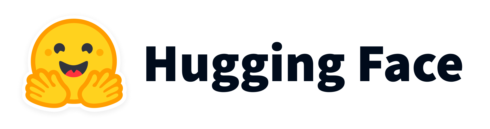

<a name="readme-top"></a>

[![Contributors][contributors-shield]][contributors-url]
[![Stargazers][stars-shield]][stars-url]
[![Cornell License][license-shield]][license-url]

<!-- PROJECT LOGO -->
<br />
<div align="center">
  <a href="https://github.com/jainr3/Google-MeetSense">
    
  </a>

  <h3 align="center">Google MeetSense</h3>

  <p align="center">
    A demo application showing a post-meeting summary, action items, and other metrics.
    <br />
    <a href="https://github.com/jainr3/Google-MeetSense#demo"><strong>View Demo »</strong></a>
    <br />
    <br />
  </p>
</div>

<!-- TABLE OF CONTENTS -->
<details>
  <summary>Table of Contents</summary>
  <ol>
    <li>
      <a href="#about-the-project">About The Project</a>
      <ul>
        <li><a href="#demo">Demo</a></li>
        <li><a href="#built-with">Built With</a></li>
      </ul>
    </li>
    <li>
      <a href="#getting-started">Getting Started</a>
      <ul>
        <li><a href="#prerequisites">Prerequisites</a></li>
        <li><a href="#installation">Installation</a></li>
      </ul>
    </li>
    <li><a href="#license">License</a></li>
    <li><a href="#contact">Contact</a></li>
  </ol>
</details>

<!-- ABOUT THE PROJECT -->
## About The Project

Google MeetSense was created to answer the following question:

```
How might we ensure that meeting organizers have a clear understanding of how to move forward after virtual medium-sized meetings?
```

Over the course of five months our team has worked to create a prototype application that demonstrates the vision for a tool that could provide a post-meeting summary, action items, and other metrics to meeting organizers. During this time, we have received feedback from a team in Google's Corporate Engineering division, our BigCo studio instructors, peers, and others. We have conducted numerous interviews to guide our thinking toward this demo application. The result is a combination of a Figma mockup, an API that processes an audio file of a real meeting to produce a real meeting summary and statistics, and a front-end application that displays this information.

<p align="right">[<a href="#readme-top">Back to Top</a>]</p>

### Demo

A demo video of the ideal usage of the product is shown below. It shows what our product might look like if integrated with Google Meet.

[](https://www.youtube.com/watch?v=DLU3H-Teb3E)

<p align="right">[<a href="#readme-top">Back to Top</a>]</p>


### Built With

* <a href="https://reactjs.org/"></a>
* <a href="https://huggingface.co/"></a>
* <a href="https://colab.research.google.com/"></a>
* <a href="https://flask.palletsprojects.com/en/2.3.x/"></a>
* <a href="https://pytorch.org/"></a>

<p align="right">[<a href="#readme-top">Back to Top</a>]</p>

<!-- GETTING STARTED -->
## Getting Started

There are a couple components to the project and the files have been broken down as follows:

1. colab notebooks: These are the Machine Learning (ML) research and prototyping code that was used to finetune the summarization model. Mainly contains attempts to fine-tune summarization (and a few transcription) models.
2. react-app: This is the front-end application that contains all the user-facing pages.
3. studio-api: This is the Google Cloud api that holds the code needed for ML models, metrics, and synthetic data.

### Prerequisites

* npm
  ```sh
  npm install npm@latest -g
  ```
* gcloud CLI [(see here)](https://cloud.google.com/run/docs/setup)
* Google Cloud project + linked billing account

### Installation

General Steps:

1. Clone the repo
   ```
   git clone https://github.com/jainr3/Google-MeetSense.git
   ```

2. Install required pre-requisites. See <a href="#prerequisites">Prerequisites</a>.

3. Setup a Google Cloud project for the API and Firebase. Generate a key.json file for the API to access Firebase [(more instructions here)](https://medium.com/google-cloud/building-a-flask-python-crud-api-with-cloud-firestore-firebase-and-deploying-on-cloud-run-29a10c502877).

Steps for deploying the studio-api on Google Cloud Run platform:

1. Download the finetuned meeting summarization model from Huggingface Model hub [here](https://huggingface.co/jainr3/t5-finetuned-meetings). Place the `t5-model-v3.pth` file in the `studio-api/model` folder.

2. Change directory in your terminal to the `studio-api` folder. Run `gcloud run deploy`. Note that to test the project locally, one may run `gcloud beta run services proxy studio-api --project insert-gcloud-project-name` (may require installation of some other packages).

3. Monitor the build progress and API logs on the Google Cloud console. Note: may need to increase the API timeout to 3600sec and allocate 2 CPUs with 8GiB memory. Also need to check box for `Allow unauthenticated invocations` under the security tab.

Steps for setting up Google Firebase:

1. Setup a firestore database collection titled `meetings` under the same Google Cloud project.

Running the react-app:

1. Ensure that the pre-requisites are installed and run `npm install` (may need to delete the `package-lock.json` file).

2. Change directory into the `react-app` folder and run `npm start` to view the page.

<p align="right">[<a href="#readme-top">Back to Top</a>]</p>

<!-- LICENSE -->
## License

Distributed under the [Cornell Standard Project Agreement (Version 2.0, May 17, 2021)](./img/CSP-EC-Agreement-v2.0.docx.pdf). See [here](https://tech.cornell.edu/csp/) for the latest information.

<p align="right">[<a href="#readme-top">Back to Top</a>]</p>

<!-- CONTACT -->
## Contact

This project was created by [Rahul Jain](https://github.com/jainr3), [James Chu](https://github.com/manguoman), [Jenny Zhu](https://github.com/jennyzzhu), [Kıvanç Komesli](https://github.com/komeslik), and [Katherine Lui](https://github.com/katherinelui) during the BigCo Studio course (Spring 2023) at Cornell Tech. 

Project Link: [https://github.com/jainr3/Google-MeetSense](https://github.com/jainr3/Google-MeetSense)

<p align="right">[<a href="#readme-top">Back to Top</a>]</p>

[contributors-shield]: https://img.shields.io/github/contributors/jainr3/Google-MeetSense.svg?style=for-the-badge
[contributors-url]: https://github.com/jainr3/Google-MeetSense/graphs/contributors
[stars-shield]: https://img.shields.io/github/stars/jainr3/Google-MeetSense.svg?style=for-the-badge
[stars-url]: https://github.com/jainr3/Google-MeetSense/stargazers
[license-shield]: https://img.shields.io/badge/LICENSE-Cornell%20Standard%20Project%20Agreement-red
[license-url]: img/CSP-EC-Agreement-v2.0.docx.pdf
[product-screenshot]: img/thumbnail.png
